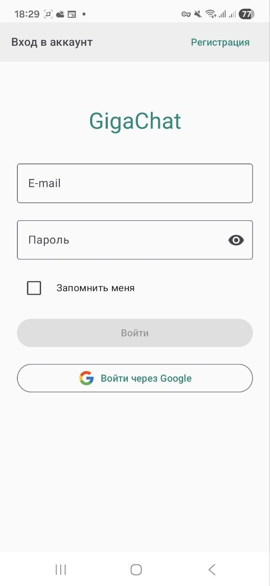
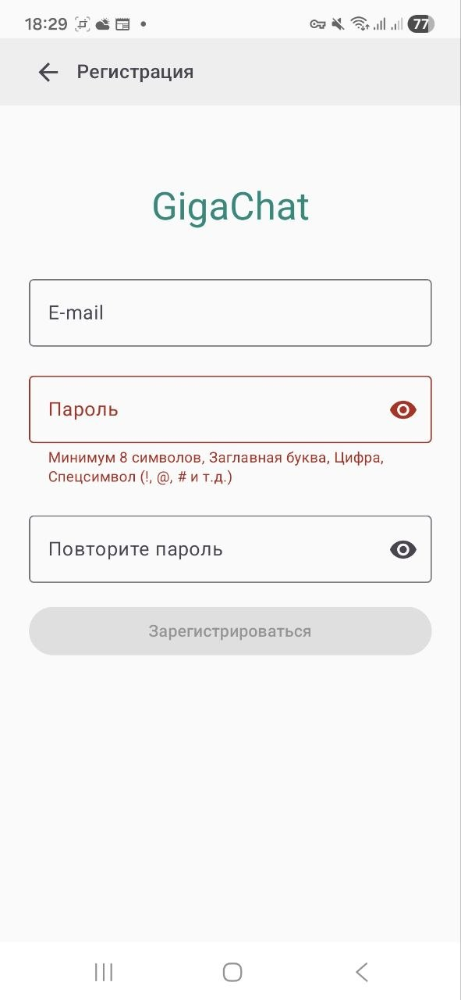
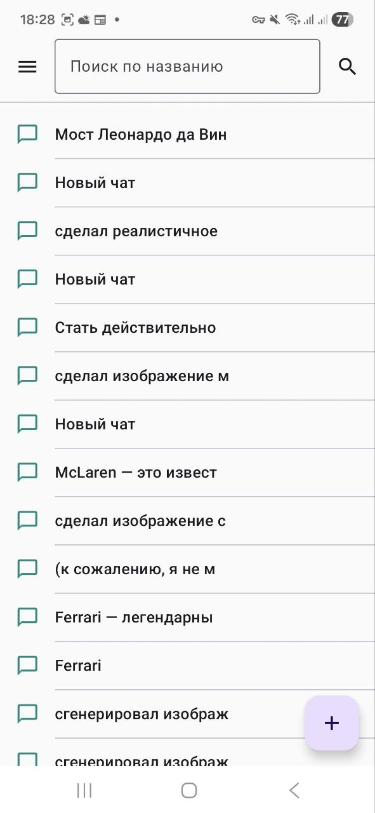
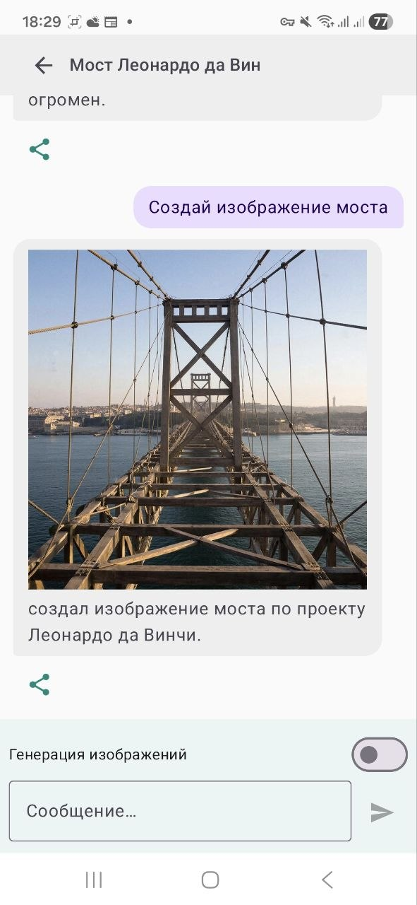
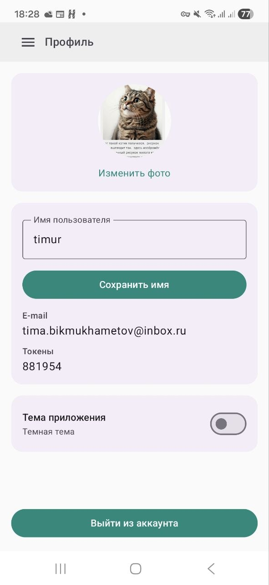

# GigaChat Android

Android-приложение чат-ассистента с авторизацией, списком диалогов, экраном переписки и профилем пользователя.

## 📱 Возможности

- Авторизация и регистрация через Firebase Authentication
- Создание новых чатов и навигация через drawer
- Список чатов с поиском и пагинацией
- Экран диалога с отправкой сообщений и генерацией ответа ассистента
- Режим генерации изображений в чате
- Профиль пользователя: изменение имени, аватара и темы приложения

## 🏗️ Архитектура

Проект построен как multi-module с разделением на `api/impl` для feature-модулей.

```text
GigaChat/
├── app
├── core
│   ├── auth
│   ├── common
│   ├── database
│   ├── designsystem
│   └── network
└── feature
    ├── auth (api, impl)
    ├── register (api, impl)
    ├── chat-list (api, impl)
    ├── chat-detail (api, impl)
    └── profile (api, impl)
```

## 🛠️ Технологии

- Kotlin 2.0.21
- Jetpack Compose (BOM 2024.09.00)
- Navigation Compose 2.8.4
- Dagger Hilt 2.59.2 + KSP
- Coroutines + Flow
- Room 2.8.4
- Retrofit 3.0.0 + OkHttp 5.3.2
- Kotlinx Serialization
- Firebase Auth (через BOM 34.11.0)
- Coil 2.7.0
- Cloudinary Android 3.1.2
- GigaChat Java SDK 0.1.14
- Kvault 1.12.2
- Timber 5.0.1

## 📦 Модули

### Core

- `core:auth` - токены/сессия и базовые auth-инструменты
- `core:common` - общие утилиты, base vm, обработка ошибок, ресурсы
- `core:database` - Room, DAO, локальное хранение чатов и сообщений
- `core:designsystem` - переиспользуемые composable-компоненты и тема
- `core:network` - клиенты API, сериализация, сетевые зависимости

### Feature

- `feature:auth` - вход в приложение
- `feature:register` - регистрация пользователя
- `feature:chat-list` - список чатов, поиск, создание нового чата
- `feature:chat-detail` - переписка, генерация ответов, retry, share, images
- `feature:profile` - профиль, фото, тема, выход из аккаунта

## 🚀 Запуск проекта

### Требования

- Android Studio актуальной версии
- Android SDK 24+ (minSdk)
- Android SDK 36 (targetSdk/compileSdk)

### Шаги

1. Клонируйте репозиторий:

```bash
git clone <repo-url>
cd GigaChat
```

2. Добавьте Firebase-конфигурацию:

- поместите `google-services.json` в `app/`
- включите Email/Password provider в Firebase Authentication

3. Синхронизируйте Gradle-проект в Android Studio.

4. Запустите приложение на устройстве/эмуляторе:

```bash
./gradlew installDebug
```

## 🧪 Тесты и качество

- Unit и instrumented тесты по модулям
- Статический анализ через Detekt

Примеры команд:

```bash
./gradlew test
./gradlew detekt
```

## 📸 Экраны

### `AuthScreen`



### `RegisterScreen`



### `ChatListScreen`



### `ChatDetailScreen`



### `ProfileScreen`



## 🎬 Демонстрация приложения

- Видео-демонстрация: [Смотреть на Google Drive](https://drive.google.com/file/d/1YTjaoVRSe00xGdy3Zse6LKN2KI1NI3FL/view?usp=drive_link)

